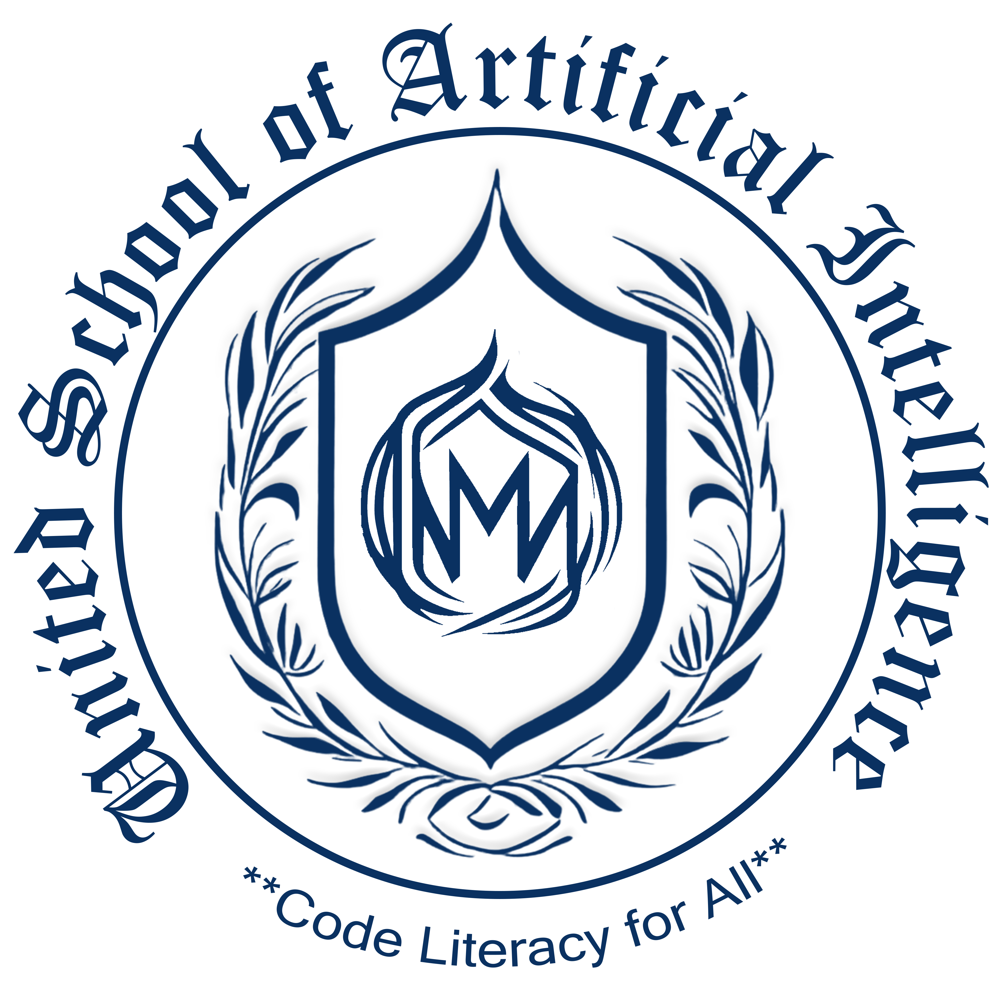

# United School of Artificial Intelligence
Imagine a school where Kindergarten children can learn and play alongside artificial intelligence and computer science technologies! Welcome to the United School of Artificial Intelligence (USAI), where we're revolutionizing early childhood education. Our innovative program brings AI and computer science to the youngest learners, fostering creativity, critical thinking, and problem-solving skills. Our experienced educators provide onsite training and education, carefully crafting a nurturing environment that sparks curiosity and excitement. Admissions are now open for the upcoming semester! Don't miss this opportunity to give your child a head start in the world of AI and technology. [Apply now](https://www.mvut.us/pages/apply) and join the USAI community, where we're shaping the next generation of innovators and thinkers!

## Kindergarten (K.G.) STEM Entrepreneurs
Welcome to USAI Kindergarten, where curiosity meets innovation! Our comprehensive program is divided into four terms, each spanning 12 weeks and consisting of 36 classes, with three engaging sessions per week. Throughout the year, our young learners embark on an exciting journey, exploring coding, STEM, entrepreneurship, and phonics. From becoming Little Coders in Term-I to transforming into STEM Explorers in Term-II, Entrepreneurs in Term-III, and Phonics Wizards in Term-IV, our students develop essential skills, creativity, and critical thinking, setting them up for lifelong success.

### [Term-I Little Coders](LittleCoders/Readme.md)

### Term-II STEM Explorers 

### Term-III Entrepreneurs

### Term-IV Phonics Wizards

Admissions are now open - [apply](https://www.mvut.us/pages/apply) today and give your child a head start in the world of AI and technology!
